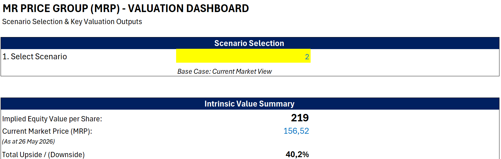
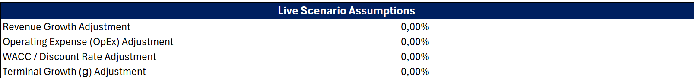
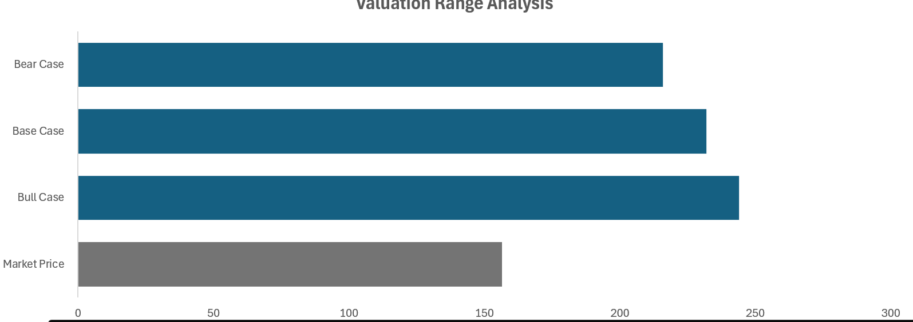
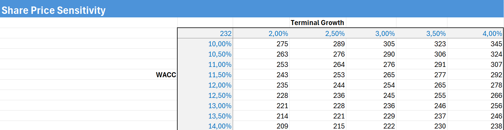
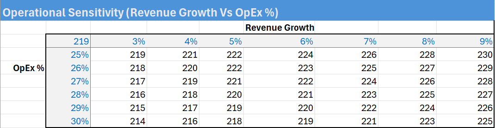

# MR PRICE GROUP (MRP) — Equity Research & DCF Valuation Model

## Overview

This project develops an integrated 3-statement financial model and discounted cash flow (DCF) valuation for Mr Price Group (JSE: MRP). The model analyses the company’s historical financial performance, forecasts future operating performance, and estimates intrinsic equity value using an unlevered free cash flow (FCFF) valuation approach.

The project was built as part of a financial modelling portfolio focused on equity research, valuation, and financial analysis.
## Valuation Dashboard

Interactive valuation dashboard with dynamic scenario selection and implied equity value outputs.

The dashboard allows dynamic switching between Bull, Base, and Bear valuation scenarios, with live updates to implied share price, valuation upside/downside, and scenario assumptions.

### Live Scenario Assumptions

Live scenario assumption adjustments for revenue growth, operating expenses, discount rate, and terminal growth across Bull, Base, and Bear valuation cases.

### Valuation Range Analysis

Comparison of implied equity value outcomes across Bear, Base, and Bull valuation scenarios relative to the prevailing market price.

## Key Features

### Financial Modelling

* Integrated 3-statement financial model
* Historical financial statement analysis
* Forecast income statement, balance sheet, and cash flow statement
* Dynamic working capital schedules

### Valuation & Forecasting

* DCF valuation using FCFF methodology
* WACC calculation using CAPM framework
* Terminal value estimation
* Bull, Base, and Bear scenario analysis

### Sensitivity Analysis

* WACC vs Terminal Growth
* Revenue Growth vs Operating Expenses

### WACC vs Terminal Growth Sensitivity

Share price sensitivity analysis showing valuation changes across discount rate and terminal growth assumptions.

---

### Revenue Growth vs Operating Expense Sensitivity

Operational sensitivity table demonstrating the impact of revenue growth and operating expense assumptions on valuation outputs.

### Dashboard & Visualization

* Interactive valuation dashboard with scenario selector

## Model Structure

The Excel valuation model is organized into modular worksheets supporting the complete equity research and valuation process:

| Sheet                   | Description                                                                                                                                               |
| ----------------------- | --------------------------------------------------------------------------------------------------------------------------------------------------------- |
| Cover Page              | Project overview, valuation highlights, and navigation interface                                                                                          |
| Dashboard               | Interactive valuation dashboard with dynamic Bull, Base, and Bear scenario outputs                                                                        |
| Assumptions             | Core forecasting assumptions, macroeconomic drivers, scenario construction, and valuation inputs                                                          |
| Historical Financials   | Historical income statement, balance sheet, and cash flow statement analysis                                                                              |
| Historical Ratios       | Ratio analysis covering profitability, liquidity, leverage, efficiency, and return metrics                                                                |
| Forecast Model          | Projected financial statements and integrated operating forecasts                                                                                         |
| DCF Valuation           | FCFF valuation model including WACC calculation, terminal value estimation, implied share price analysis, and WACC vs terminal growth sensitivity testing |
| Operational Sensitivity | Revenue growth vs operating expense sensitivity analysis and operational scenario testing                                                                 |

The model is fully integrated, with assumptions dynamically flowing through forecast schedules, valuation outputs, dashboard visuals, and sensitivity analysis tables.

---

# Valuation Summary (Base Case)

| Metric                |   Value |
| --------------------- | ------: |
| Implied Share Price   |    R232 |
| Current Market Price* | R156.52 |
| Implied Upside        |   47.9% |
| WACC                  |  13.32% |
| Terminal Growth Rate  |    3.0% |

*Market data and valuation assumptions as at 26 May 2026.

---

# Dashboard Features

The model includes a dynamic valuation dashboard with:

* Scenario selector (Bull / Base / Bear)
* Live scenario assumption adjustments
* Intrinsic value summary
* Valuation range analysis
* Market price comparison

---

# Forecast Methodology

## Revenue Forecasting

Revenue was forecast using a combination of:

* Historical growth trends
* Retail sales growth assumptions
* Credit sales mix analysis
* Other revenue as a percentage of total revenue

## Margin Forecasting

Margins were forecast based on:

* Historical operating performance
* Gross margin trends
* Operating expense efficiency
* Expected normalization in South African consumer conditions

## Working Capital

Working capital schedules were forecast using operational efficiency assumptions:

* Inventory Days
* Debtor (Receivable) Days
* Creditor (Payable) Days

## Valuation Approach

The DCF valuation was performed using:

* FCFF methodology
* CAPM-derived cost of equity
* WACC discounting
* Terminal growth method

---

# Sensitivity Analysis

Because valuation outcomes are highly sensitive to long-term assumptions, the model includes:

1. Share price sensitivity to WACC and terminal growth assumptions
2. Operational sensitivity to revenue growth and operating expense assumptions

This helps assess valuation robustness across multiple operating and macroeconomic environments.

---

# Files Included

| File        | Description                                            |
| ----------- | ------------------------------------------------------ |
| Excel Model | Full integrated financial model and valuation workbook |
| PDF Summary | Summary of valuation methodology and outputs           |
| README      | Project overview and modelling explanation             |

---

# Skills Demonstrated

* Financial modelling
* Equity valuation
* DCF analysis
* Forecast modelling
* Working capital analysis
* Sensitivity analysis
* Scenario analysis
* Excel dashboard development
* Financial statement analysis

---

# Disclaimer

This project was created for educational and portfolio purposes only and does not constitute investment advice.

---

# Author

Buzwekazi George 
Financial Modelling Portfolio Project (2026)
